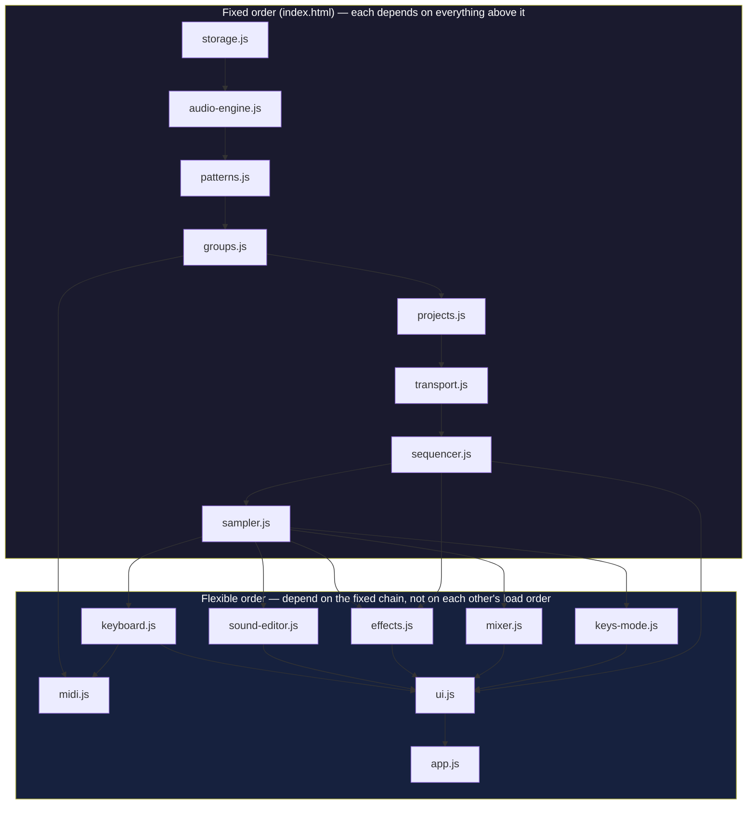

# EP-133 Workstation — Module Architecture

This document describes the actual implementation under
`midi-office/js/workstation/`: load order, module responsibilities, the
shared audio graph, the IndexedDB schema, the pub/sub patterns used for
cross-module communication, and how the whole thing plugs into MIDI
OFFICE's existing window dock.

All of this is one more module inside the larger MIDI OFFICE page — it
does not have its own HTML document, its own `AudioContext`, or its own
window-management code. It reuses all three from the host page.

---

## 1. Module dependency diagram

Load order is fixed by `<script>` tags in `index.html`. The first eight
files (`storage` → `sampler`) form a real dependency chain — each one
calls into globals the previous ones expose on `window` — and **must**
stay in this relative order. Everything from `keyboard.js` onward reads
those same globals but doesn't get read *by* any of the earlier files,
so their mutual order is flexible (they're ordered alphabetically-ish
in the HTML, not causally).



Plain-text summary of the fixed chain and why it's fixed:

```
storage.js      <- no deps (wraps IndexedDB directly)
audio-engine.js <- window.ToneEngine (root js/audio-engine.js, loaded earlier)
patterns.js     <- no deps (pure data module)
groups.js       <- window.WorkstationAudio (setGroupFader)
projects.js     <- WorkstationGroups, WorkstationTransport, WorkstationStorage,
                    WorkstationPatterns, WorkstationSampler (optional)
transport.js    <- WorkstationPatterns (TICKS_PER_QUARTER), WorkstationAudio (context)
sequencer.js    <- WorkstationPatterns, WorkstationTransport, WorkstationGroups,
                    WorkstationSampler
sampler.js      <- WorkstationAudio, WorkstationGroups, WorkstationStorage,
                    window.ToneEngine (root)
---------------------------------------------------------------- (order free below)
keyboard.js     <- WorkstationGroups, WorkstationSequencer, WorkstationTransport,
                    WorkstationEffects/Sampler/KeysMode/UI (read lazily at call time)
sound-editor.js <- WorkstationSampler, WorkstationGroups
effects.js      <- WorkstationPatterns, WorkstationGroups, WorkstationAudio,
                    WorkstationSequencer (onStep)
mixer.js        <- WorkstationGroups, WorkstationAudio
keys-mode.js    <- WorkstationGroups, WorkstationSampler
midi.js         <- WorkstationGroups, WorkstationKeyboard, WorkstationSequencer,
                    WorkstationAudio, WorkstationKeysMode, WorkstationTransport
ui.js           <- nearly everything above (it's the chrome that wires all modes)
app.js          <- WorkstationUI only
```

Every module attaches its public surface to `window.Workstation*` inside
an IIFE; there are no ES modules or bundler-managed imports, so these
`window` globals are the only linking mechanism — hence the hard
ordering requirement on the first eight files.

---

## 2. Per-file responsibility

**storage.js** — Thin IndexedDB wrapper (`midi-office-ep133` database,
version 1). Exposes generic `put`/`get`/`delete`/`getAll`/
`getAllByIndex` plus one composed operation, `deleteProjectCascade`, so
callers never touch a raw `IDBTransaction`. Every function returns a
Promise; `isAvailable()` lets callers (projects.js) degrade gracefully
when IndexedDB is missing (e.g. private browsing).

**audio-engine.js (workstation)** — Builds the Workstation's own node
graph rooted at the single page-wide `AudioContext` (see §3). Owns the
four group buses (input → sidechain-duck → fader), the master → punch
bus → limiter chain that ultimately feeds `ToneEngine.connectDry()`,
sidechain ducking (`duck()`), and the global voice registry used by
panic (Esc stops every registered voice immediately).

**patterns.js** — Pure, audio-free data module for per-group step
sequences: 12 lanes (one per pad), 96-ticks-per-quarter-note resolution,
sparse per-step events (`{step, velocity, durationTicks, offsetTicks}`).
Provides creation, editing (`setEvent`, `nudge`, `quantize`), and
bar-level copy/paste. Has no idea what an `AudioContext` is — scheduling
against real time is sequencer.js's job.

**groups.js** — Owns the four independent groups' (A–D) runtime state:
12 pad-sound assignments, pattern list/selection, mute groups, and fader
level. Switching the "active" group only changes what the UI/keyboard
currently points at for editing — every group's own state persists
regardless of which one is active, and all four play simultaneously
during playback (see sequencer.js).

**projects.js** — The top-level container: tempo/time signature
(delegated to transport.js), scenes (named snapshots of each group's
active pattern — the EP-133 "commit" concept), and song mode (an ordered
list of scene references). Persistence is opt-in per action
(`saveProject`/`loadProject`), not automatic on every edit, mirroring
the EP-133's own explicit-save model.

**transport.js** — Owns the clock: BPM, time signature, swing,
metronome, tap tempo, and the actual lookahead scheduler (schedules
ahead of `AudioContext.currentTime` on a short `setTimeout` poll rather
than firing audio directly off `setInterval`, which drifts audibly).
Anything that needs to react to the clock subscribes via `onTick()`
instead of running its own timer.

**sequencer.js** — Consumes transport.js's tick stream to actually play
every group's active pattern in parallel, and to record into them
(live, quantized-or-free-time; or step, with a cursor while stopped).
Also drives note-repeat and single-level undo (one previous snapshot
per pattern, matching the EP-133's own umbrella-icon model rather than a
full history stack).

**sampler.js** — Owns every sound's data (decoded buffer + parameters:
trim, pitch, pan, envelope, play mode, reverse, chop, mute group, etc.)
and is the *only* module that actually builds a playback voice
(`AudioBufferSourceNode` + gain/pan). `sequencer.js` and `keys-mode.js`
both call `triggerPad()`/`triggerNote()` here rather than touching Web
Audio nodes themselves. Also owns the generated (non-sampled) demo kit,
mic-recording-to-pad, and the serialize/restore bridge projects.js uses
to persist sounds (including a minimal dependency-free WAV encoder for
IndexedDB storage).

**keyboard.js** — The computer keyboard IS the instrument. Binds via
`KeyboardEvent.code` (not `.key`) so physical-key position is what
matters across layouts. Owns mode (`sound`/`keys`/`sequencer`/`sample`/
`fx`/`mixer`) and the FUNCTION/Shift/Backspace/Tab modifier state
machine, and is the single dispatch point `padDown`/`padUp` that both
real keyboard input and mouse/touch pad clicks (ui.js) funnel through.

**sound-editor.js** — Renders the Sound-Edit panel (file load, trim
waveform, chop, play-mode/pan, envelope, time, MIDI, mute group) for
whichever pad is selected. Owns no audio itself — every read/write goes
through `WorkstationSampler` (data+playback) and `WorkstationGroups`
(mute-group membership); this file only builds and wires DOM.

**effects.js** — The EP-133's one-FX-engine model: exactly one
sustained send/return effect type active at a time (delay, reverb,
distortion, chorus, filter, compressor), built lazily and fully torn
down on switch. Also owns the live-input (mic) path through the same FX
bus, momentary punch-in performance effects spliced into the
master→punch-bus connection, and sidechain-ducking *detection* (it
mirrors sequencer.js's own tick-matching math but calls the
already-implemented `WorkstationAudio.duck()` rather than re-triggering
playback).

**mixer.js** — Renders one channel strip per group plus a master strip,
adding mute/solo on top of the single fader number groups.js already
has room for. Keeps its own local `storedFader` per letter so a user's
dialed-in level survives being temporarily forced to zero by mute/solo;
documents a known gap where the main panel's single FADER knob can
bypass this bookkeeping (out of scope to fix inside this file).

**keys-mode.js** — The EP-133 "Keys" performance mode: all 12 pads play
*one* source sound at different pitches across a selectable scale.
Never builds `AudioNode`s itself — every note goes through
`WorkstationSampler.triggerNote()`, reusing the sampler's own legato
voice-stealing group (keyed by the source pad index) for free.

**midi.js** — Bridges the Web MIDI API into the same group/pad shape
keyboard.js drives (notes 36–83 map to groups A–D, 12 pads each; Keys
mode instead gets the raw 0–127 note number for chromatic play).
Degrades gracefully under every failure mode (unsupported, denied,
no device) and wraps every external entry point so a malformed message
or a downstream throw can never take down the page. Also exposes
advisory incoming-clock BPM estimation and MIDI CC "learn"/sustain.

**ui.js** — Renders the panel chrome: display readout, 12-pad grid,
group/mode buttons, transport, fader, X/Y knobs, and the keymap
overlay. Mouse/touch handlers call the exact same dispatch functions
keyboard.js uses, so there is one input-handling path, not two.
Mode-specific bodies (`sound`/`fx`/`mixer`/`keys`/`sequencer`) mount
into `#wsModeBody` by delegating to the owning module. Owns tear-down:
`buildWindow()` returns a `cleanup()` that unregisters every
subscription it made, since the window can be closed and reopened many
times.

**app.js** — The bootstrap. Exposes `buildWindow(container)` in the
exact shape every other MIDI OFFICE module uses, delegating straight to
`WorkstationUI.buildWindow`. This is the only file `js/modules.js`
(the module registry) needs to know about.

---

## 3. Shared AudioContext / audio-graph architecture

There is exactly **one** `AudioContext` for the entire MIDI OFFICE page.
It is created lazily inside the pre-existing root module
`js/audio-engine.js` (`window.ToneEngine`), on first `init()` call —
browsers require a user gesture before audio can start, so every module
(root and Workstation alike) calls `init()` defensively rather than the
page having a dedicated "tap to begin" screen.

The Workstation's own `js/workstation/audio-engine.js`
(`window.WorkstationAudio`) never calls `new AudioContext()` — it calls
`window.ToneEngine.init()` to obtain the shared context, then builds its
*own* subgraph on top of it:

```
Root (js/audio-engine.js, window.ToneEngine):
  synth voices -> dryGain -\
                             +-> masterGain -> destination
  synth voices -> delayNode (feedback loop) -> delayWetGain -/
                                                     masterGain -> recorderDestination (MediaStream, tapped by recorder.js)

Workstation (js/workstation/audio-engine.js, window.WorkstationAudio),
grafted onto the SAME context via ToneEngine.connectDry():

  per group g in {A,B,C,D}:
    voice (sampler.js) -> groupInput[g] -> groupDuck[g] (sidechain) -> groupFader[g] -\
                                  \-> (effects.js sends tap groupInput[g] directly)    |
                                                                                        v
                                                                           workstationMaster
                                                                                        |
                                                                                        v
                                                                                   punchBus  <- momentary FX spliced in here
                                                                                        |
                                                                                        v
                                                                                    limiter (DynamicsCompressor, safety)
                                                                                        |
                                                                                        v
                                                                      ToneEngine.connectDry(limiter)  -> masterGain -> destination
```

Consequences of this design:

- The Workstation is "just another source" on the root module's master
  bus. `recorder.js`'s existing recording tap (`recorderDestination`,
  fed from `masterGain`) automatically captures the Workstation with no
  second recorder needed.
- `effects.js`'s sustained send/return FX and live-mic path both tap
  `groupInput[g]` directly (in parallel with the dry signal reaching
  `groupFader[g]`), so turning a send to 0 silences only the effect, not
  the group.
- Punch-in performance FX (also effects.js) are inserted by *replacing*
  the single `workstationMaster -> punchBus` connection with a short
  series chain for as long as pads are held, then restoring the direct
  wire — "one front door," so there is exactly one place that edge can
  be observed/rebuilt.
- Sidechain ducking lives as a per-group gain node (`groupDuck[g]`)
  between `groupInput` and `groupFader`; `effects.js` detects trigger
  hits (mirroring sequencer.js's tick math) and calls
  `WorkstationAudio.duck()`, but never builds a second playback path.
- Panic (Esc) force-stops every voice that called `registerVoice()`
  (sampler.js, on every triggered voice) and resets every group's duck
  gain — the one place "stop everything" is implemented.

---

## 4. IndexedDB schema (storage.js)

Database `midi-office-ep133`, version 1, with six object stores, all
keyed by `id` (string). Normalized rather than one nested blob, so
editing a single sound or pattern doesn't require re-serializing an
entire project.

| Store | Key | Fields |
|---|---|---|
| **projects** | `id` | `id`, `name`, `createdAt`, `updatedAt`, `tempo`, `timeSigNum`, `timeSigDen`, `scenes` (array), `songPositions` (array of scene ids, ≤99) |
| **groups** | `id` = `"<projectId>:<letter>"` | `id`, `projectId` (indexed), `letter`, `soundIds` ([12], null if empty pad), `activePatternId`, `patternIds` ([...]), `muteGroups` (array of arrays of pad indices), `fader` |
| **sounds** | `id` | `id`, `projectId` (indexed), `groupLetter`, `blobId` (ref into `blobs`, null if no audio loaded), `name`, `trimStart`, `trimEnd`, `pitch`, `gain`, `pan`, `playMode`, `attack`, `release`, `reverse`, `timeMode`, `timeValue`, `midiChannel`, `rootNote`, `muteGroupId`, `chop` |
| **patterns** | `id` | `id`, `projectId` (indexed), `groupLetter`, `name`, `lengthSteps`, `lanes` ([12] arrays of `{step, velocity, durationTicks, offsetTicks}`) |
| **scenes** | `id` | `id`, `projectId` (indexed), `name`, `groupPatternIds` (`{A, B, C, D}` -> pattern id) |
| **blobs** | `id` = `"blob_<soundId>"` | `id`, `data` (ArrayBuffer — raw WAV-encoded audio, kept separate from sound metadata since it's the only genuinely large part) |

Indexes: `groups`, `sounds`, `patterns`, and `scenes` each have a
non-unique index on `projectId`, used by `getAllByIndex` to load/delete
everything belonging to one project. `deleteProjectCascade(projectId)`
composes exactly that: delete every sound's referenced blob, then every
`groups`/`sounds`/`patterns`/`scenes` row by `projectId` index, then the
`projects` row itself.

Note that in-memory runtime objects (e.g. a sound's decoded
`AudioBuffer`) are stripped before writing (`stripRuntimeFields`) and
rebuilt on load by decoding the matching `blobs` row.

---

## 5. Pub/sub patterns for cross-module communication

There is no central event bus — every module that needs to be reacted
to exposes its own narrowly-named subscribe function, matching what it
actually emits:

| Function | Owner | Fires on |
|---|---|---|
| `onTick(fn)` | transport.js | every scheduled clock tick (`fn(tick, time)`) |
| `onStep(fn)` | sequencer.js | every transport tick, after triggering that tick's pad hits (`fn(tick)`) — used by ui.js for playhead refresh and by effects.js for sidechain hit detection |
| `onChange(fn)` | groups.js, projects.js | active-group switch / any project-level mutation |
| `onStateChange(fn)` | transport.js | any transport state change (play/stop/bpm/swing/metronome/...) |
| `onModeChange(fn)` | keyboard.js | sound/keys/sequencer/sample/fx/mixer mode switch |
| `onPadVisual(fn)` | keyboard.js | a pad's pressed/released visual state, independent of what that press *did* |

All six follow the same shape: `subscribe(fn)` pushes `fn` onto a local
listener array and **returns an `off()` function** that splices it back
out. Every call site is wrapped in try/catch internally so one
misbehaving listener can't block the others or crash playback.

This `off()` return value is not incidental — **ui.js's `buildWindow()`
depends on it for correctness.** The Workstation window can be closed
and reopened arbitrarily many times (window-manager.js calls
`buildWindow()` fresh on every open), and `buildWindow()` collects every
subscription it makes into an array and calls each one's `off()` inside
the `cleanup()` it returns. Without a working unregister, N opens would
mean N stacked listeners firing on every single tick/state
change — each one touching whatever `root`/`modeBodyEl` DOM references
were current *at subscription time*, including references already
nulled out by an earlier `cleanup()`, which throws trying to query a
null root.

**This was a real bug, not a hypothetical:** during testing, an earlier
version of one of these emitters only supported adding listeners, with
no way to remove one. Reopening the Workstation window a second time
immediately threw inside a stale `refreshDisplay()` call reacting to a
tick it had no business still listening to. The fix — making every one
of the six emitters above return a real `off()`, and having ui.js
actually call them in `cleanup()` — is now load-bearing. Any new
`onX(fn)`-style subscription added to this module in the future must
follow the same contract (push-and-return-unregister) or the same class
of bug reappears the moment someone closes and reopens the window.

---

## 6. Window-manager integration

The Workstation does not have its own page or route — it is one more
entry in MIDI OFFICE's existing floating-window dock, the same
mechanism every other module (Sequencer, Synth, Delay, Sampler, DJ,
AI Jam, Recorder) already uses:

1. **`js/modules.js`** (`window.ToneModules`) is the single registry the
   dock (`js/app.js`) and the Help panel (`js/help.js`) both read from.
   The Workstation's entry there is just data: `id: "workstation"`,
   display name, description, default window size, and a `build`
   function: `build: function (container) { return
   window.Workstation.buildWindow(container); }`.
2. **`js/workstation/app.js`** supplies that `window.Workstation` global,
   with a `buildWindow(container)` that returns whatever
   `window.WorkstationUI.buildWindow(container)` returns — the exact
   `build(container) -> cleanup()` shape `js/window-manager.js` expects
   from every module, with no Workstation-specific special-casing
   anywhere in the window manager itself.
3. **`js/window-manager.js`**'s `openModule(id)` looks the module up in
   `window.ToneModules`, builds the floating-window chrome
   (titlebar/resize/minimize/maximize/taskbar chip — all generic), calls
   `mod.build(chrome.content)`, and stores whatever that call returns as
   the window's cleanup callback, invoked from `closeWindow(id)`.
4. Because `ui.js`'s `buildWindow()` properly tears down its
   subscriptions in the returned `cleanup()` (see §5), the Workstation
   window can be opened, closed, and reopened through the normal dock
   controls as many times as any other module, with no special
   lifecycle handling required from the window manager.

In short: the Workstation plugs into the dock by exposing exactly the
`id` → `build(container)` → `cleanup()` contract every other module
already implements, so none of the generic window-management code
(dragging, resizing, taskbar, stacking order) needed to change to
support it.
